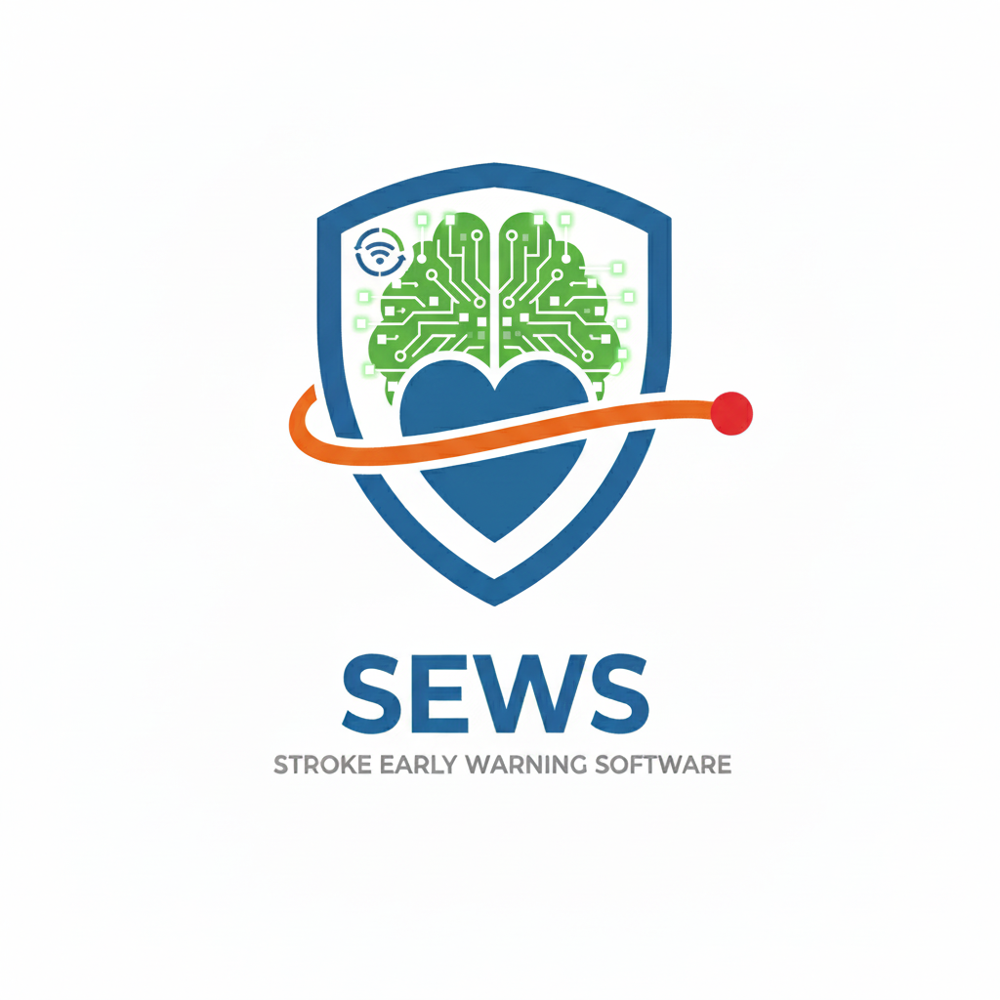

# 🏥 SEWS - Stroke Early Warning System

<p align="center">
  
</p>

<p align="center">
  <strong>Hệ thống Cảnh báo Sớm Đột quỵ</strong><br>
  Ứng dụng di động hỗ trợ dự đoán nguy cơ đột quỵ và quản lý sức khỏe toàn diện
</p>

<p align="center">
  
  
  
  
</p>

---

## 📋 Mục lục

- [Giới thiệu](#-giới-thiệu)
- [Tính năng](#-tính-năng)
- [Screenshots](#-screenshots)
- [Cài đặt](#-cài-đặt)
- [Cấu trúc dự án](#-cấu-trúc-dự-án)
- [Công nghệ](#-công-nghệ)
- [Tài liệu](#-tài-liệu)
- [Đóng góp](#-đóng-góp)
- [Liên hệ](#-liên-hệ)

---

## 🎯 Giới thiệu

**SEWS (Stroke Early Warning System)** là ứng dụng di động được phát triển nhằm:

- 🧠 **Dự đoán nguy cơ đột quỵ** sử dụng AI/Machine Learning
- 📊 **Theo dõi sức khỏe** với biểu đồ trực quan
- 👨‍⚕️ **Kết nối bác sĩ** để tư vấn và đặt lịch khám
- 👨‍👩‍👧‍👦 **Quản lý gia đình** theo dõi sức khỏe người thân
- 🆘 **Hỗ trợ khẩn cấp** với tính năng SOS

---

## ✨ Tính năng

### 👤 Người dùng (User)
| Tính năng | Mô tả |
|-----------|-------|
| 🔐 Xác thực | Đăng ký/Đăng nhập Email, Google |
| 🧠 Dự đoán AI | Dự đoán nguy cơ đột quỵ, tiểu đường |
| 📊 Theo dõi sức khỏe | Biểu đồ huyết áp, đường huyết, BMI |
| 🆘 SOS Khẩn cấp | Gửi yêu cầu cấp cứu với GPS |
| 📅 Đặt lịch hẹn | Đặt lịch khám với bác sĩ |
| 💬 Chat | Nhắn tin với bác sĩ |
| 👨‍👩‍👧‍👦 Gia đình | Theo dõi sức khỏe người thân |
| 💊 Nhắc thuốc | Nhắc nhở uống thuốc đúng giờ |
| 📚 Kiến thức | Bài viết sức khỏe |
| 🗣️ Diễn đàn | Cộng đồng chia sẻ |

### 👨‍⚕️ Bác sĩ (Doctor)
| Tính năng | Mô tả |
|-----------|-------|
| 📋 Dashboard | Thống kê ca trực |
| 👥 Bệnh nhân | Quản lý hồ sơ bệnh nhân |
| 📅 Lịch hẹn | Duyệt và quản lý lịch hẹn |
| 🆘 SOS | Xử lý ca khẩn cấp |
| 💬 Chat | Tư vấn bệnh nhân |
| ⏰ Lịch làm việc | Cài đặt slot khám |

### 🔧 Quản trị (Admin)
| Tính năng | Mô tả |
|-----------|-------|
| 📊 Dashboard | Thống kê tổng quan |
| 👥 Users | Quản lý người dùng |
| 👨‍⚕️ Doctors | Quản lý bác sĩ |
| 🏥 Patients | Quản lý bệnh nhân |
| 🆘 SOS | Giám sát ca khẩn cấp |
| 📚 Knowledge | Quản lý bài viết |

---

## 📱 Screenshots

<p align="center">
  
  
  
</p>

---

## 🚀 Cài đặt

### Yêu cầu
- Flutter SDK >= 3.5.4
- Dart SDK >= 3.5.4
- Android SDK (API 23+)
- Python 3.8+ (cho AI API)

### Cài đặt Development

```bash
# 1. Clone repository
git clone https://github.com/quanglong3824/early_warning_software_for_stroke.git
cd early_warning_software_for_stroke

# 2. Install Flutter dependencies
flutter pub get

# 3. Install Python dependencies (cho AI API)
cd assets/models
pip3 install -r requirements.txt
cd ../..

# 4. Run app
./start.sh

# Hoặc chạy riêng:
flutter run -d chrome    # Web
flutter run              # Mobile
```

### Cài đặt APK

📦 **File APK**: `release/SEWS_v1.0.0.apk`

Xem hướng dẫn chi tiết: [HƯỚNG DẪN CÀI ĐẶT](release/HUONG_DAN_CAI_DAT.md)

### Tài khoản test

| Vai trò | Email | Mật khẩu |
|---------|-------|----------|
| User | user@test.com | 123456 |
| Doctor | doctor@test.com | 123456 |
| Admin | admin@test.com | 123456 |

---

## 📁 Cấu trúc dự án

```
early_warning_software_for_stroke/
├── 📁 android/              # Android native code
├── 📁 assets/               # Static assets
│   ├── data/                # JSON data files
│   ├── img/                 # Images & screenshots
│   └── models/              # AI model & Flask API
├── 📁 lib/                  # Flutter source code
│   ├── data/                # Models & providers
│   ├── features/            # UI screens (91 files)
│   │   ├── admin/           # Admin features
│   │   ├── doctor/          # Doctor features
│   │   └── user/            # User features
│   ├── services/            # Business logic (34 services)
│   ├── utils/               # Utilities
│   └── widgets/             # Shared widgets
├── 📁 docs/                 # Documentation
├── 📁 release/              # Release APK
├── 📁 test/                 # Test files
└── 📁 web/                  # Web platform
```

---

## 🛠️ Công nghệ

### Frontend
| Technology | Version | Purpose |
|------------|---------|---------|
| Flutter | 3.5.4+ | UI Framework |
| Provider | 6.1.1 | State Management |
| Firebase | Latest | Backend Services |
| Hive | 2.2.3 | Offline Cache |
| fl_chart | 0.69.0 | Charts |

### Backend
| Technology | Purpose |
|------------|---------|
| Firebase Auth | Authentication |
| Firebase Realtime DB | Database |
| Firebase Storage | File Storage |
| Firebase Messaging | Push Notifications |
| Flask | AI Prediction API |

### AI/ML
| Technology | Purpose |
|------------|---------|
| scikit-learn | ML Model |
| Random Forest | Classification |

---

## 📚 Tài liệu

| Document | Description |
|----------|-------------|
| [📖 README](docs/README.md) | Tài liệu tổng quan |
| [🏗️ Architecture](docs/ARCHITECTURE.md) | Kiến trúc hệ thống |
| [🔌 API Reference](docs/API_REFERENCE.md) | API documentation |
| [📱 User Guide](docs/USER_GUIDE.md) | Hướng dẫn sử dụng |
| [🔧 Build Guide](BUILD_RELEASE.md) | Hướng dẫn build |

---

## 🤝 Đóng góp

1. Fork repository
2. Tạo branch mới (`git checkout -b feature/AmazingFeature`)
3. Commit changes (`git commit -m 'Add AmazingFeature'`)
4. Push to branch (`git push origin feature/AmazingFeature`)
5. Tạo Pull Request

---

## 📞 Liên hệ

- **Developer**: Quang Long
- **Email**: quanglong3824@gmail.com
- **GitHub**: [quanglong3824](https://github.com/quanglong3824)

---

## 📄 License

Distributed under the MIT License. See `LICENSE` for more information.

---

<p align="center">
  Made with ❤️ by Quang Long
</p>
